# 智能营销系统：系统初始化设置手册

## 一、服务启动前设置

### 1、.env环境参数设置

设置WEBUI_ADMIN_EMAIL为您的域账号，推荐设置该管理员账号的初始密码WEBUI_ADMIN_PASSPWORD，方便首次登录时直接使用邮件密码登录，速度更快。示例图如下：

设置如下图的OPENAI_API_KEY为您的Kimi Api Key，供系统连接外部模型提供OPENAI格式的API_KEY（此处已设置服务提供商为Kimi，可根据需要替换默认服务提供商，或在服务启动后在管理员面板中设置）

### 2、docker-compose.yaml服务设置

#### 2.1、ports：端口设置

为该服务设置端口。示例图如下：

#### 2.2、environment中域账号登录相关设置

为进行域账号登录，需要将environment中WEBUI_URL与OPENID_REDIRECT_URI设置为该服务运行的URL及端口，示例图如下：

#### 2.3、volumes：挂载路径设置

为持久化存储/迁移服务数据，需设置数据库的挂载路径。示例图如下：

## 二、服务启动

使用docker compose up -d启动服务，需等待1~2min，直至前端服务启动后，才能访问该服务。等待时间受服务器性能影响

## 三、服务启动后设置

由于Openwebui中存在大量配置无法通过环境变量预定，因此需要管理员在首次启动服务（未形成数据库文件）时，手动进行相关设置，具体操作如本节所示。

### 1、管理员面板

在侧边栏左下角或页面右上角，点击账户头像，打开“管理员面板”，由此进入相关页面进行设置：

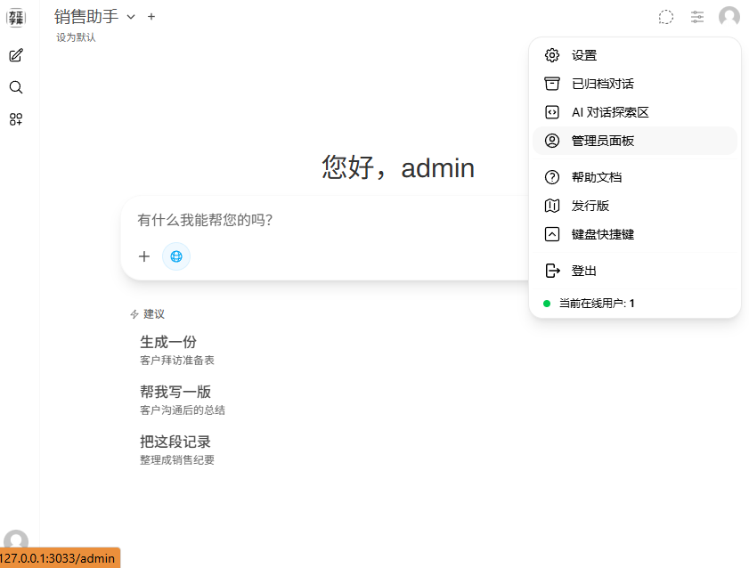

#### 1.1、用户-用户组

在该页面中，需设置“默认权限”，尽量简化“用户”对话页面的内容。该页面的入口如下图所示：

可以根据需求自行配置，推荐按下图所示进行设置，页面中其余设置全部关闭，修改完成后保存：

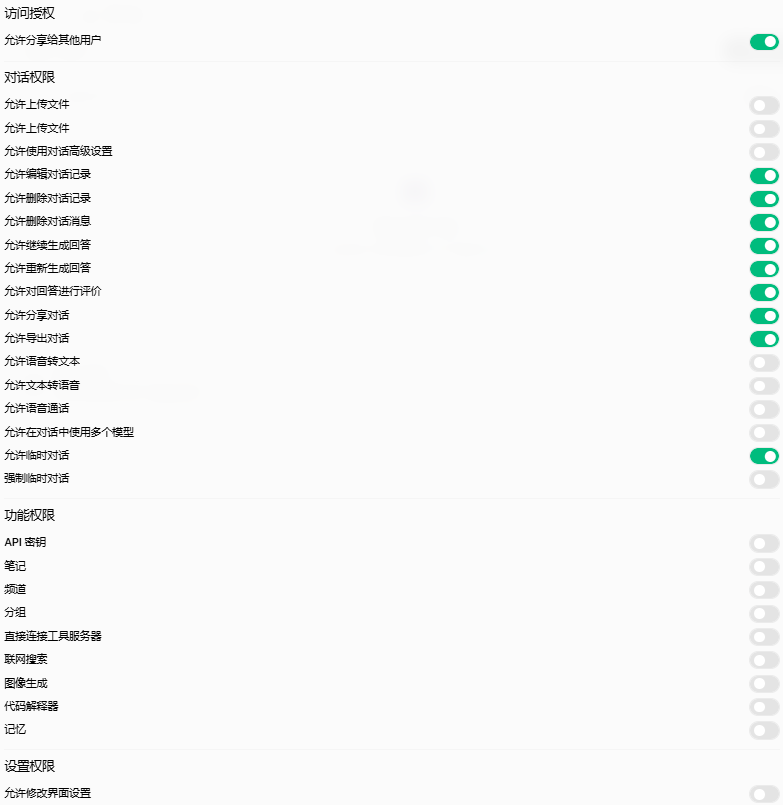

具体而言，本处的初始化操作主要为：

- 对话权限

关闭“允许上传文件”、“允许临时对话”和“允许在对话中使用多个模型”。

- 功能权限

关闭除“联网搜索”外的全部权限

- 设置权限

关闭“允许修改页面设置”

#### 1.2、设置-通用

在该页面中，对通用功能进行设置，推荐按下图所示进行设置，页面中其余设置全部关闭，修改完成后保存：

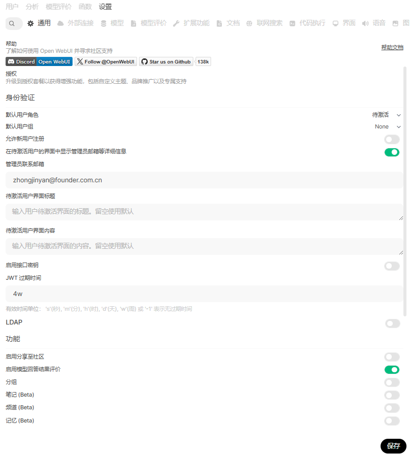

具体而言，本处的初始化操作主要为：

- 身份验证

默认用户角色“待激活”，不允许新用户注册，开启“在待激活***显示管理员邮箱等详细信息”，填写“管理员邮箱”

- 功能

开启“启用模型回答结果评价”，关闭其他所有功能

#### 1.3、设置-外部连接

在该页面中，对外部连接进行设置，推荐按下图所示进行设置，页面中其余设置全部关闭，修改完成后保存：

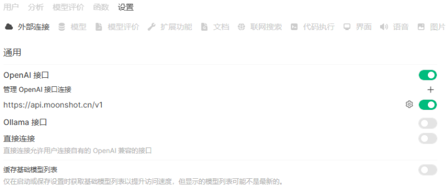

具体而言，本处的初始化操作主要为：

- 关闭Ollama接口

- Kimi(moonshot)外部连接配置

若未在.env中填写API，则在此处填写密钥，同时可以添加如“Kimi”的“模型ID前缀”和“标签”，便于区分和筛选

- 其他API服务商

根据需求配置其他API服务商，如Qwen/Deepseek等

#### 1.4、设置-模型

外部连接配置成功后，该页面中将显示所有API支持的模型。可以在该页面中，查看并设置所有“基础模型”，可以根据需要关闭部分模型，如下图所示：

#### 1.5、设置-模型评价

在该页面中可以设置“模型评价”，推荐按下图所示进行设置，关闭模型盲测，修改完成后保存

#### 1.6、设置-文档

在该页面中，对文档功能进行设置，推荐按下图所示进行设置，页面中其余设置全部关闭或为空，修改完成后保存

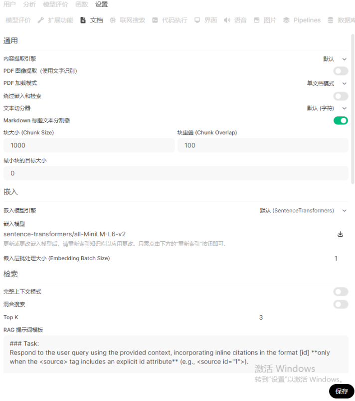

具体而言，本处的初始化操作主要为：

- 将PDF加载模式调整为“单文档模式”

#### 1.7、设置-代码执行

在该页面中，对代码执行功能进行设置，推荐按下图所示进行设置，全部关闭所有功能，修改完成后保存

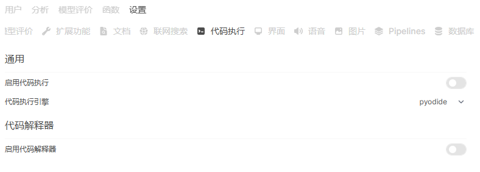

具体而言，本处的初始化操作主要为：

- 关闭“启动代码执行”

- 关闭“启动代码解释器”

#### 1.8、设置-界面

在该页面中，对各种功能进行设置，推荐按下图所示进行设置，其余设置不修改，修改完成后保存

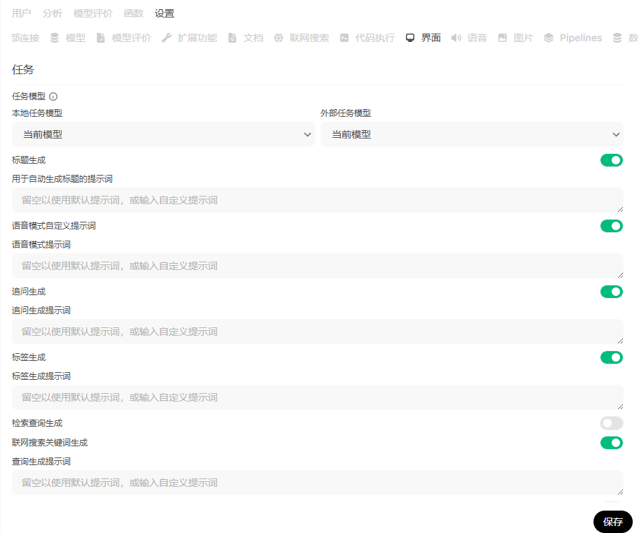

具体而言，本处的初始化操作主要为：

1）关闭“检索查询生成”

#### 1.9、其余设置

“管理员面板”其余子页面中的功能均不改动，采用默认设置即可，如扩展功能、联网搜索、语音、图片、Pipelines、数据库

### 2、工作空间

为导入知识库并配置默认模型，需要进入

#### 2.1、知识库

##### 2.1.1、创建知识库

上传PDF作为知识库，处理时间受服务器CPU影响，将调用嵌入模型对PDF等文档生成向量库。

###### 2.1.2、创建“销售知识”知识库

根据需求填写描述，如下图所示：

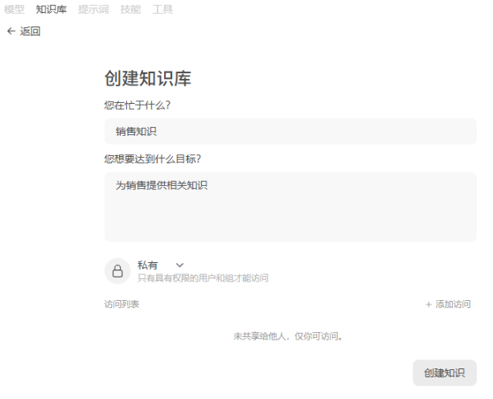

###### 2.1.3、上传PDF文件

将收集到五本销售书籍的PDF上传到知识库中，上传页面如下：

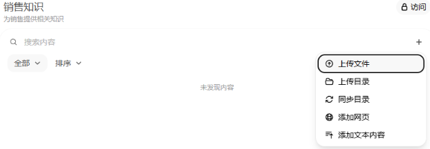

#### 2.2、模型

##### 2.2.1、创建“销售助手”模型

点击页面中右上角“创建模型”按钮，进入模型设置页面，完成相关设置后，点击“保存并创建”来创建模型：

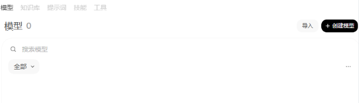

###### a）自定义名称，如“销售助手”

###### b）设置模型ID（创建后不可更改！），如260515-2014

###### c）设置模型权限，点击如下按钮进入“访问控制”页面

将访问控制设置为“公开”，如下图所示。未设置“公开”模型，将导致“用户”无法对话

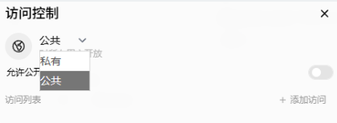

###### d）设置基础模型，如kimi-k2.5

###### e）设置备用模型，在基础模型访问失败时自动切换，如kimi-k2.6

###### f）可选：添加“描述”或“标签”，方便筛选模型

###### g）设置系统提示词，将“销售助手-提示词.txt”中的文本复制进去

###### h）知识库设置，选择之前创建的“销售知识”知识库

###### i）各项能力设置

推荐按照下图进行设置：

具体操作如下：

- 关闭“能力设置”中的“视觉”、“图像”和“代码解释器”

- 打开“销售能力”中的“拜访准备表”

##### 2.2.2、开启“销售助手”模型的API联网功能

完成“销售助手”模型的创建后，通过以下按钮进入模型设置页面，打开如图所示的“API联网搜索功能”：

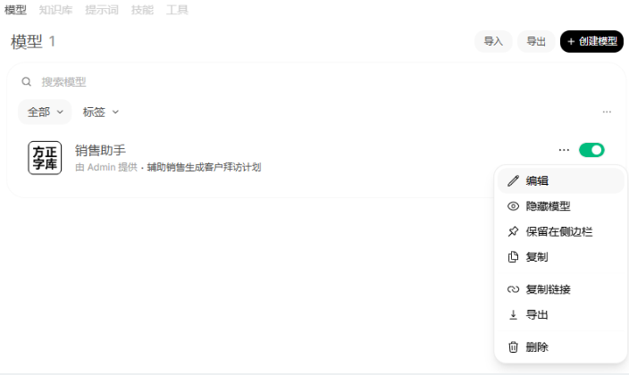

#### 2.3、为“用户”配置默认模型

##### 2.3.1、进入相关页面

进入“管理员面板-设置-模型”页面，点击如下图所示右上方的“设置”进行详细设置：

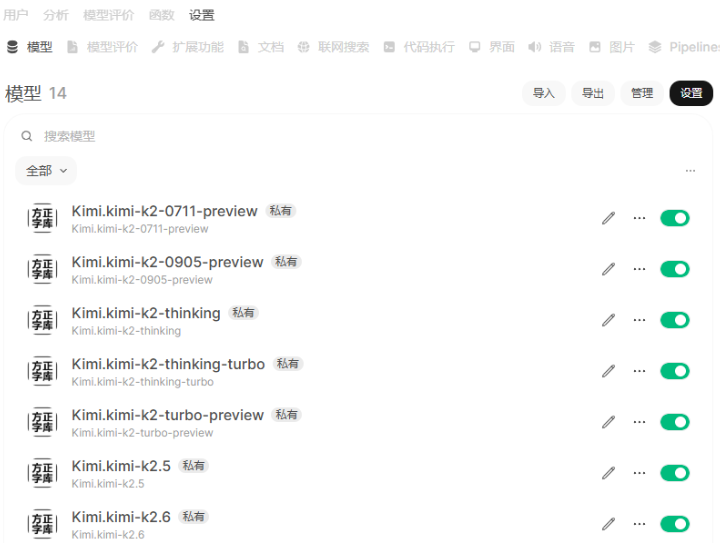

##### 2.3.2、模型更改

选择刚创建的“销售助手”模型，设置为用户默认对话模型，且“强制普通用户使用该模型”，完成修改后保存：

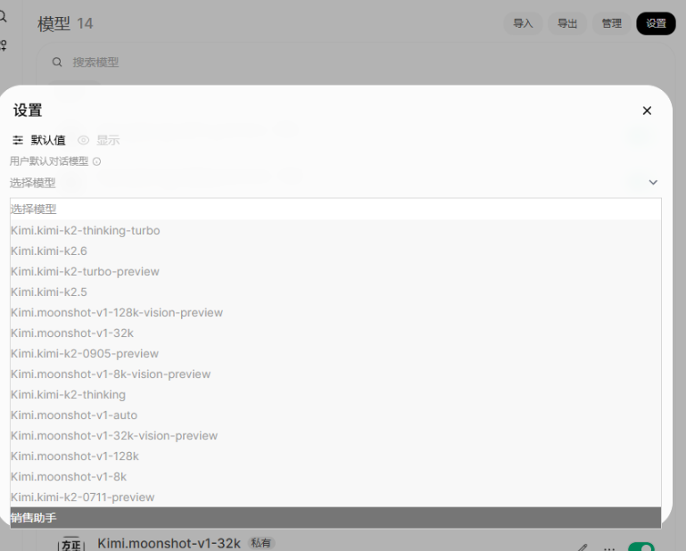

移除显示为空的模型。模型右侧的“-”号可以移除现有模型

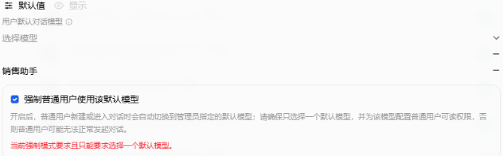

## 四、测试对话效果

### 1、选择“销售助手”进行对话

#### 1.1、联网测试：

现在是什么时间，国内有哪些时政新闻

#### 1.2、拜访计划准备测试

##### 1.2.1、第一轮提示词：

我是方正字体公司的销售，准备拜访字节跳动的设计主管，与客户之前有过合作，本次主要做关系维护，了解客户近期项目和用字需求。

##### 1.2.2、完成回复后，点击“拜访准备表”按钮：

### 2、开启联网搜索，使用思考模式及openwebui原工具调用效果

#### 2.1、工作空间-模型，创建新模型

##### 2.1.1、复制销售助手

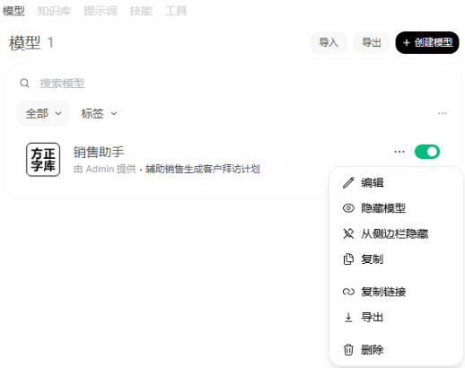

##### 2.1.2、重新命名并设置模型ID

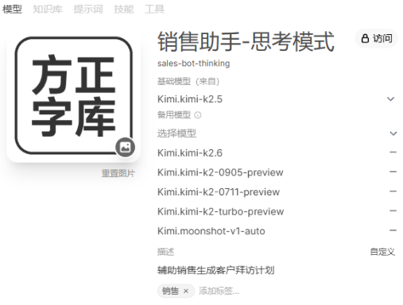

##### 2.1.3、关闭API联网搜索

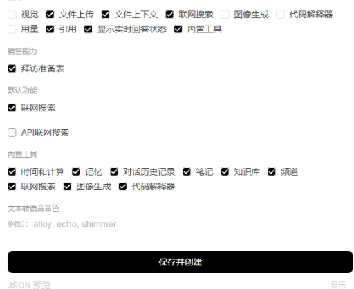

##### 2.1.4、保存并创建

#### 2.2、选择创建的新模型，并测试

### 3、重新设置“默认对话模型”

若需要重新为“用户”设置“默认对话模型”，则回到【为“用户”配置默认模型】步骤进行设置

## 五、注意事项

### 1、为用户设置“强制默认模型”

#### 1.1、在“管理员页面-设置-模型-设置页面”中

##### 1.1.1、选择“用户默认对话模型”；

##### 1.1.2、勾选“强制普通用户使用***”

#### 1.1.3、在“工作空间-模型”的该“模型设置”页面中

##### a）访问控制 设置为“公共”

##### b）该模型的“基础模型”与“备用模型”，其服务商及API可有效访问

### 2、域账号激活

#### 2.1、域账号登录后，将在“智能营销系统”中自动创建一个“待激活”账号

#### 2.2、“待激活”账号需要管理员在“管理员面板”-“用户组”-“用户”中，手动将该账号的身份由“待激活”更改为“用户”后，才能进入系统

### 3、启用/关闭“模型回答结果评价”功能

#### 3.1、开启/关闭此功能

要开启此功能，管理员在管理员面板相应页面中打开两个开关：

| 位置 | 开关 | 例图 |
| -- | -- | -- |
| 设置-通用 | 启用模型回答结果评价 |  |
| 用户-用户组-默认权限 | 允许对回答进行评价 |  |

#### 3.2、该功能效果

开启该功能后，用户/管理员将能够在如下页面中进行评价/查看：

| 权限 | 位置 | 开关 | 例图 |
| -- | -- | -- | -- |
| 用户/管理员 | 模型回复消息下侧 | 点击按钮打开评价弹窗 |  |
| 管理员 | 模型评价-反馈 | 点击反馈打开评价 |  |